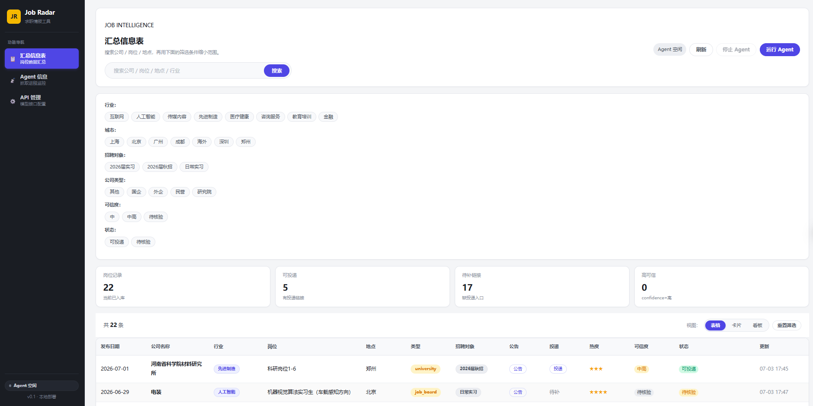
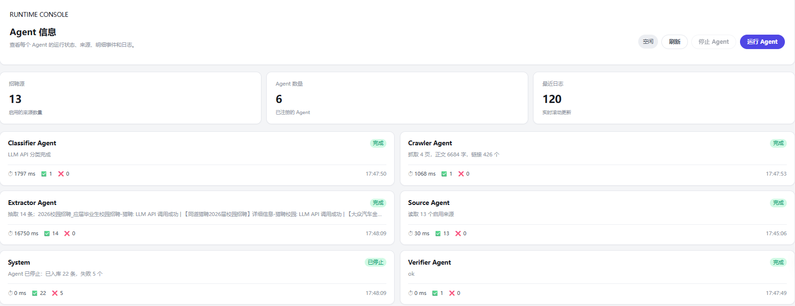
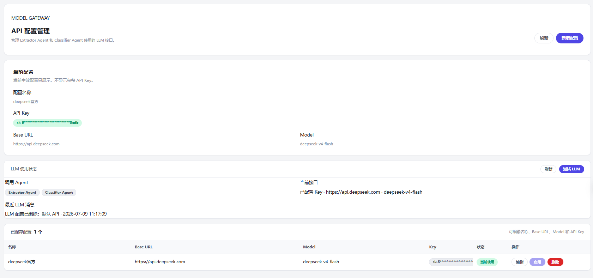

# Job Radar

Job Radar 是一个面向校招、实习和社会招聘信息聚合的本地智能 Agent 系统。项目通过多来源网页抓取、LLM 信息抽取、规则校验、岗位分类和可视化监控，把分散在高校就业网、招聘平台和企业招聘站中的岗位信息整理成可检索、可筛选、可追踪的汇总表。

## 功能特性

- 多来源招聘信息采集：支持高校就业网、聚合招聘平台、实习平台和企业招聘入口。
- Agent 流水线：Source、Crawler、Extractor、Verifier、Classifier 五类 Agent 分工处理来源读取、页面抓取、岗位抽取、链接校验和分类入库。
- LLM 接入管理：支持多 API 配置保存、切换、测试和调用状态记录，API Key 前端脱敏展示。
- 岗位信息结构化：抽取公司名称、岗位名称、公告链接、投递链接、招聘对象、城市、行业、公司类型、可信度等字段。
- 可视化看板：提供汇总表、卡片视图、投递看板、Agent 运行状态、日志和明细事件。
- 本地部署：FastAPI + SQLite + Vue 3，适合个人求职信息收集和二次开发。

## 页面预览

### 招聘信息汇总



### Agent 运行监控



### API 配置管理



## 技术栈

- Backend: Python, FastAPI, SQLite, requests, BeautifulSoup, OpenAI-compatible SDK
- Frontend: Vue 3, TypeScript, Vite, Element Plus
- Agent: 多阶段流水线、规则兜底、LLM JSON 抽取与分类

## 项目结构

```text
job-radar/
  backend/                 # FastAPI 后端与 Agent 流水线
  frontend/                # Vue 前端
  data/settings.example.json
  sources.yaml             # 招聘信息来源配置
  launcher.py              # 本地启动/停止管理
  启动.bat / 停止.bat       # Windows 一键启动脚本
```

## 本地运行

本项目是本地运行的招聘信息聚合工具。使用者需要先把项目下载到自己的电脑上运行，然后访问自己电脑上的 `http://127.0.0.1:8765/`。

1. 克隆项目：

```bash
git clone https://github.com/yeshixiao66/job-radar.git
cd job-radar
```

2. 安装后端依赖：

```bash
pip install -r backend/requirements.txt
```

3. 安装前端依赖并构建：

```bash
cd frontend
npm install
npm run build
cd ..
```

4. 配置 LLM：

复制 `data/settings.example.json` 为 `data/settings.json`，填入自己的 API Key、Base URL 和模型名称。

5. 启动服务：

```bash
python launcher.py start
```

访问本地端口 `http://127.0.0.1:8765/`。

Windows 用户也可以直接双击 `启动.bat` 启动，双击 `停止.bat` 停止。

## 访问方式

- 自己电脑使用：启动后访问 `http://127.0.0.1:8765/`。
- 局域网内其他设备访问：需要将服务监听地址改为 `0.0.0.0`，并使用运行机器的局域网 IP 访问，例如 `http://192.168.1.23:8765/`。

## 安全说明

本项目不会提交本地 API 配置、SQLite 数据库、运行日志、前端构建产物和依赖目录。使用者需要根据 `data/settings.example.json` 自行创建 `data/settings.json`，并配置自己的 API Key、Base URL 和模型名称。请妥善保管个人 API Key。
